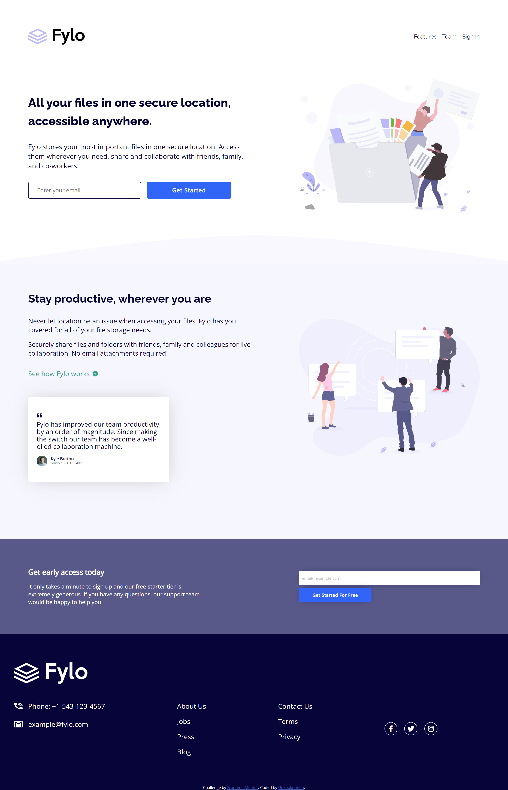

# Frontend Mentor - Fylo landing page with two column layout solution

This is a solution to the [Fylo landing page with two column layout challenge on Frontend Mentor](https://www.frontendmentor.io/challenges/fylo-landing-page-with-two-column-layout-5ca5ef041e82137ec91a50f5). Frontend Mentor challenges help you improve your coding skills by building realistic projects.

### Screenshot

### Links

- Solution URL: https://www.frontendmentor.io/solutions/fylo-landing-page-with-two-column-layout-solution-oXi-VsTqMO
- Live Site URL: https://unkookerinho.github.io/Fylo-landing-page-with-two-column-layout-solution/
